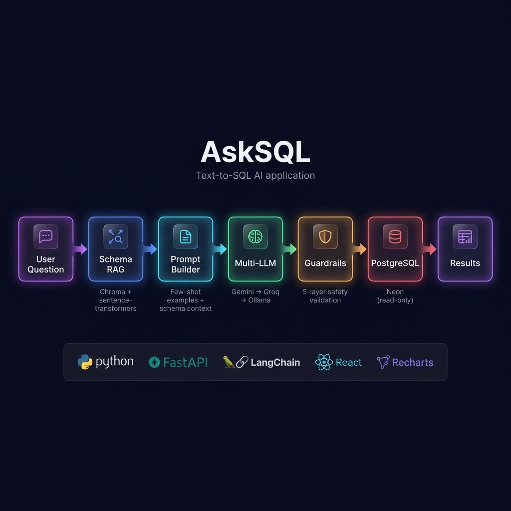

<div align="center">

# ⚡ AskSQL

### Text-to-SQL AI Assistant with RAG & Safety Guardrails

*Ask questions in plain English → Get SQL + real results from a live database*

[](https://python.org)
[](https://fastapi.tiangolo.com)
[](https://react.dev)
[](https://langchain.com)
[](https://neon.tech)
[](LICENSE)

🔗 **[Try the Live Demo →](https://ask-sql-tau.vercel.app)**

---

**[Features](#-features) · [Architecture](#-architecture) · [Quick Start](#-quick-start) · [Tech Stack](#-tech-stack) · [How It Works](#-how-it-works) · [Guardrails](#-guardrails)**

</div>

---

## 🎯 What Is This?

AskSQL is a **full-stack AI assistant** that converts natural language questions into SQL queries, executes them against a real PostgreSQL database, and returns the results — all through a polished chat interface.

> **The pitch:** *"Built a full-stack RAG-based text-to-SQL assistant with schema-aware retrieval, multi-provider LLM routing, and production-grade safety guardrails — deployed end-to-end on a $0 cloud stack."*

**This isn't a toy demo.** It solves the real problems that make text-to-SQL hard in production:

| Problem | How AskSQL Solves It |
|---|---|
| **Context overflow** — LLMs can't fit an entire schema in one prompt | Schema RAG retrieves only the relevant tables/columns |
| **Lost business meaning** — Column names like `qty_per_unit` need context | Rich schema descriptions embedded in vector store |
| **Hallucinated SQL** — LLMs generate invalid column/table names | RAG grounds the LLM in actual schema, with retry on failure |
| **Safety** — Generated SQL could DROP tables or leak data | 5-layer guardrail system + read-only DB connection |
| **Single point of failure** — One LLM goes down, app breaks | Multi-provider routing: Gemini → Groq → Ollama fallback |

---

## ✨ Features

- 🔍 **Natural Language to SQL** — Ask questions in plain English, get accurate PostgreSQL queries
- 🧠 **Schema-Aware RAG** — Retrieves only relevant schema context using vector similarity search
- 🛡️ **5-Layer Safety Guardrails** — SELECT-only enforcement, injection detection, row limits, timeouts, read-only DB
- 🔄 **Multi-Provider LLM Routing** — Gemini (primary) → Groq (backup) → Ollama (local) with automatic fallback
- 💬 **Chat Interface** — Beautiful dark-theme UI with syntax-highlighted SQL and interactive results
- 📊 **Auto-Visualization** — Automatically generates charts when results are chart-friendly
- ⚡ **Self-Healing** — Retries with error feedback when the first SQL attempt fails validation
- 📋 **Copy & Explore** — One-click SQL copy, scrollable results table, formatted values

---

## 🏗️ Architecture

<div align="center">



</div>

**Pipeline flow:**

```
User question (plain English)
        │
        ▼
 ┌──────────────────────────────────────────────┐
 │  [1] SCHEMA RAG                              │
 │  Chroma vector search over table/column      │
 │  descriptions → retrieves relevant context   │
 └──────────────┬───────────────────────────────┘
                │
                ▼
 ┌──────────────────────────────────────────────┐
 │  [2] PROMPT BUILDER                          │
 │  question + retrieved schema + few-shot      │
 │  examples → structured prompt                │
 └──────────────┬───────────────────────────────┘
                │
                ▼
 ┌──────────────────────────────────────────────┐
 │  [3] LLM (Multi-Provider)                    │
 │  Gemini 2.5 Flash → Groq → Ollama           │
 │  Automatic fallback on failure               │
 └──────────────┬───────────────────────────────┘
                │
                ▼
 ┌──────────────────────────────────────────────┐
 │  [4] GUARDRAILS                              │
 │  • SELECT-only enforcement                   │
 │  • SQL injection pattern detection           │
 │  • Multi-statement rejection                 │
 │  • Auto LIMIT injection                      │
 │  • Retry with error feedback (1 attempt)     │
 └──────────────┬───────────────────────────────┘
                │
                ▼
 ┌──────────────────────────────────────────────┐
 │  [5] EXECUTE (Neon PostgreSQL)               │
 │  Read-only connection · Statement timeout    │
 └──────────────┬───────────────────────────────┘
                │
                ▼
   SQL + Results + Chart → React Frontend
```

---

## 🚀 Quick Start

### Prerequisites

- Python 3.11+
- Node.js 18+
- A [Neon](https://neon.tech) PostgreSQL database (free tier)
- At least one LLM API key ([Google AI Studio](https://aistudio.google.com/apikey) or [Groq](https://console.groq.com/keys))

### 1. Clone & Setup

```bash
git clone https://github.com/Rohan797217/ASK_SQL.git
cd ASK_SQL
```

### 2. Backend Setup

```bash
cd backend

# Create virtual environment
python -m venv venv
source venv/bin/activate    # Linux/Mac
# venv\Scripts\activate     # Windows

# Install dependencies
pip install -r requirements.txt

# Configure environment
cp .env.example .env
# Edit .env with your API keys and database URL
```

### 3. Initialize Database

```bash
python -m scripts.init_db
```

This creates the Northwind schema (8 tables, ~200 rows of sample data) in your Neon database.

### 4. Start Backend

```bash
uvicorn app.main:app --reload
```

Backend runs at `http://localhost:8000` · API docs at `http://localhost:8000/docs`

### 5. Frontend Setup

```bash
cd ../frontend

npm install
npm run dev
```

Frontend runs at `http://localhost:5173`

### 6. Ask Away! 🎉

Open `http://localhost:5173` and try:
- *"What are the top 5 products by total revenue?"*
- *"How many customers are from each country?"*
- *"Which orders haven't been shipped yet?"*
- *"Show me monthly order counts"*

---

## 🔧 Tech Stack

| Layer | Technology | Why |
|---|---|---|
| **LLM** | Gemini 2.5 Flash / Groq / Ollama | Multi-provider routing with local fallback |
| **Orchestration** | LangChain | Handles retrieval → prompt → SQL pipeline |
| **Vector DB** | Chroma | Embeddable, free, no hosting cost |
| **Embeddings** | sentence-transformers (all-MiniLM-L6-v2) | Local, fast, free — no paid API calls |
| **Database** | Neon (Serverless PostgreSQL) | 100 CU-hrs/month free, scale-to-zero |
| **Backend** | FastAPI | Async, auto-docs, type-safe with Pydantic |
| **Frontend** | React 19 + Vite | Fast dev, modern tooling |
| **Charts** | Recharts | Auto-visualization of query results |

**Total monthly cost: $0** (bounded by daily API rate limits)

---

## 🧠 How It Works

### Schema RAG (Retrieval-Augmented Generation)

Instead of stuffing the entire database schema into every prompt (which wastes tokens and confuses the LLM), AskSQL uses **vector similarity search** to retrieve only the relevant tables and columns:

1. **Indexing**: Each table's schema (name, description, columns with types and business descriptions) is embedded using `sentence-transformers` and stored in Chroma
2. **Retrieval**: When a user asks a question, we embed the question and find the top-k most similar schema chunks
3. **Augmentation**: The retrieved schema context is injected into the LLM prompt alongside few-shot examples

This solves two critical problems from production text-to-SQL systems:
- **Context overflow** — Only relevant schema goes into the prompt
- **Lost business meaning** — Column descriptions explain what `qty_per_unit` actually means

### Multi-Provider LLM Routing

AskSQL doesn't depend on a single LLM provider:

```
Request → Try Gemini 2.5 Flash
              ↓ (fail?)
          Try Groq (Llama 3.3 70B)
              ↓ (fail?)
          Try Ollama (local Llama 3.1 8B)
              ↓ (fail?)
          Return error with diagnostics
```

This demonstrates real-world engineering awareness: cost optimization, reliability, and graceful degradation.

---

## 🛡️ Guardrails

AskSQL implements **defense in depth** — not just one check, but 5 layers:

| Layer | What It Does | Why It Matters |
|---|---|---|
| **1. SELECT-only** | Parses SQL with `sqlparse`, rejects any non-SELECT statement | Prevents DROP, DELETE, UPDATE, INSERT, ALTER |
| **2. Blocked keywords** | Regex whole-word match against 20+ dangerous keywords | Catches attempts to bypass parsing |
| **3. Multi-statement** | Rejects queries containing `;` followed by another statement | Prevents SQL injection via stacked queries |
| **4. Injection patterns** | 12+ regex patterns for common injection techniques | Blocks UNION injection, time-based attacks, file access |
| **5. Auto LIMIT** | Injects `LIMIT 500` if no LIMIT clause present | Prevents accidental full-table scans |
| **6. Read-only DB** | PostgreSQL connection opened in read-only mode | Defense in depth — even if app-layer fails |
| **7. Statement timeout** | 10-second query timeout at the database level | Prevents resource exhaustion |

When validation fails, the system **retries once** with the error message fed back to the LLM, giving it a chance to self-correct.

---

## 📁 Project Structure

```
AskSQL/
├── backend/
│   ├── app/
│   │   ├── main.py              # FastAPI app with /ask and /health endpoints
│   │   ├── config.py            # Environment-based settings
│   │   ├── database.py          # PostgreSQL connection & read-only execution
│   │   ├── schema_rag.py        # Chroma vector store + schema retrieval
│   │   ├── sql_generator.py     # Prompt engineering + LLM SQL generation
│   │   ├── guardrails.py        # 5-layer SQL validation & safety
│   │   ├── llm_providers.py     # Multi-provider routing with fallback
│   │   └── models.py            # Pydantic request/response schemas
│   ├── data/
│   │   ├── northwind_schema.sql # Database DDL
│   │   ├── northwind_data.sql   # Sample data (~200 rows)
│   │   └── schema_descriptions.json  # RAG corpus with business descriptions
│   ├── scripts/
│   │   └── init_db.py           # One-time database setup script
│   ├── requirements.txt
│   └── .env.example
├── frontend/
│   ├── src/
│   │   ├── App.jsx              # Main app shell
│   │   ├── components/
│   │   │   ├── ChatInterface.jsx    # Chat UI with suggestions
│   │   │   ├── SqlDisplay.jsx       # Syntax-highlighted SQL
│   │   │   ├── ResultsTable.jsx     # Scrollable data table
│   │   │   ├── ChartDisplay.jsx     # Auto-detecting bar charts
│   │   │   └── LoadingSpinner.jsx   # Animated loading state
│   │   ├── index.css            # Design system (dark theme)
│   │   └── App.css              # Component styles
│   ├── package.json
│   └── vite.config.js
├── .gitignore
├── LICENSE
└── README.md                    # ← You are here
```

---

## 🧪 Sample Queries to Try

| Question | What It Tests |
|---|---|
| *"Show all customers from Germany"* | Single table, WHERE filter |
| *"What are the top 5 products by total revenue?"* | JOIN + aggregation + ORDER BY + LIMIT |
| *"How many orders were placed each month?"* | DATE_TRUNC + GROUP BY |
| *"Which orders haven't been shipped yet?"* | NULL check |
| *"What is the average product price per category?"* | JOIN + AVG + GROUP BY |
| *"DROP TABLE customers"* | ⛔ Blocked by guardrails |

---

## 🤝 Contributing

Contributions are welcome! Feel free to open issues or submit PRs.

---

## 📄 License

[MIT](LICENSE) — Use freely for your own projects.

---

<div align="center">

**Built with ❤️ as a portfolio project demonstrating production-grade AI engineering**

*RAG • Multi-Provider LLM • Safety Guardrails • Full-Stack*

</div>
